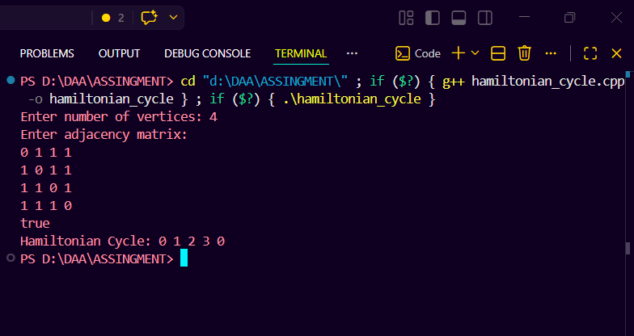
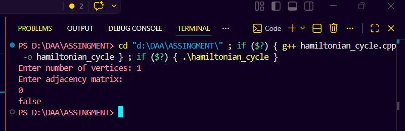
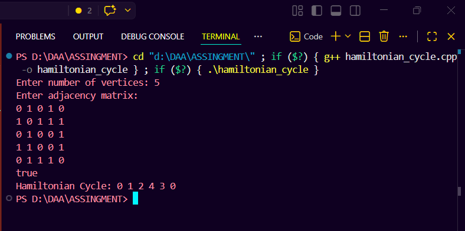
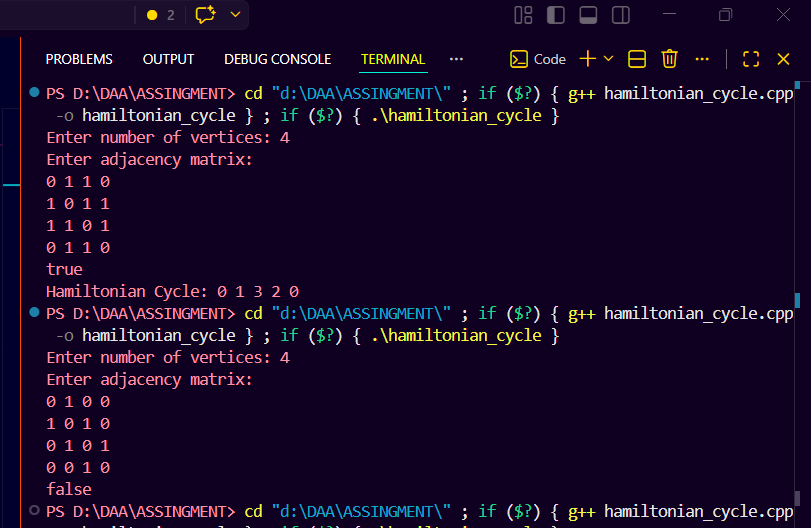
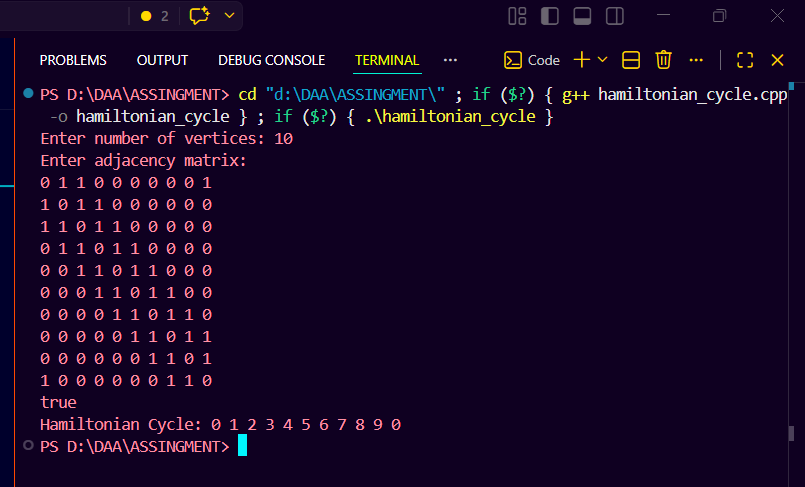

# Hamiltonian Cycle

## Problem Statement

Given an undirected graph, determine whether a Hamiltonian cycle exists.

A Hamiltonian cycle is a cycle that visits every vertex exactly once and returns to the starting vertex.

The program should:

- Use adjacency matrix representation.
- Print one valid Hamiltonian cycle if it exists.
- Print `false` if no Hamiltonian cycle exists.

## Approach

The solution uses backtracking. The path starts from vertex `0`, and then the program tries to add one unvisited vertex at a time.

A vertex can be added to the current path only if:

- It is connected to the previous vertex.
- It has not already been included in the path.

After all vertices are added, the program checks whether the last vertex is connected back to the first vertex.

## C++ Code

```cpp
#include <bits/stdc++.h>
using namespace std;

bool isSafe(int node, int place, const vector<vector<int>> &graph,
            const vector<int> &path) {
    if (graph[path[place - 1]][node] == 0) {
        return false;
    }

    for (int i = 0; i < place; i++) {
        if (path[i] == node) {
            return false;
        }
    }

    return true;
}

bool findCycle(int place, const vector<vector<int>> &graph, vector<int> &path,
               int n) {
    if (place == n) {
        return graph[path[n - 1]][path[0]] == 1;
    }

    for (int node = 1; node < n; node++) {
        if (isSafe(node, place, graph, path)) {
            path[place] = node;

            if (findCycle(place + 1, graph, path, n)) {
                return true;
            }

            path[place] = -1;
        }
    }

    return false;
}

int main() {
    int n;

    cout << "Enter number of vertices: ";
    cin >> n;

    if (n <= 0) {
        cout << "false\n";
        return 0;
    }

    vector<vector<int>> graph(n, vector<int>(n));

    cout << "Enter adjacency matrix:\n";
    for (int i = 0; i < n; i++) {
        for (int j = 0; j < n; j++) {
            cin >> graph[i][j];
        }
    }

    vector<int> path(n, -1);
    path[0] = 0;

    if (findCycle(1, graph, path, n)) {
        cout << "true\n";
        cout << "Hamiltonian Cycle: ";

        for (int i = 0; i < n; i++) {
            cout << path[i] << " ";
        }
        cout << path[0] << '\n';
    } else {
        cout << "false\n";
    }

    return 0;
}
```

## How to Compile and Run

### Compile

```bash
g++ -std=c++17 hamiltonian_cycle.cpp -o hamiltonian_cycle
```

### Run

```bash
./hamiltonian_cycle
```

On Windows PowerShell:

```powershell
.\hamiltonian_cycle.exe
```

## Sample Input

```text
5
0 1 0 1 0
1 0 1 1 1
0 1 0 0 1
1 1 0 0 1
0 1 1 1 0
```

## Sample Output

```text
Enter number of vertices: Enter adjacency matrix:
true
Hamiltonian Cycle: 0 1 2 4 3 0
```

## Output Screenshot

Paste your output image below this line:

<!-- Paste Hamiltonian Cycle output screenshot here -->

### output_1:

### output_2:

### output_3:

### output_4:

### output_5:



## Complexity Analysis

### Time Complexity

```text
O(N!)
```

The algorithm may try different permutations of vertices. The safety check also scans the current path, so a more detailed upper bound is `O(N * N!)`.

### Space Complexity

```text
O(N^2)
```

The adjacency matrix takes `O(N^2)` space. The path array and recursion stack take `O(N)` extra space.
