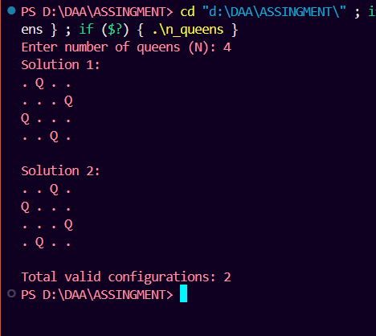
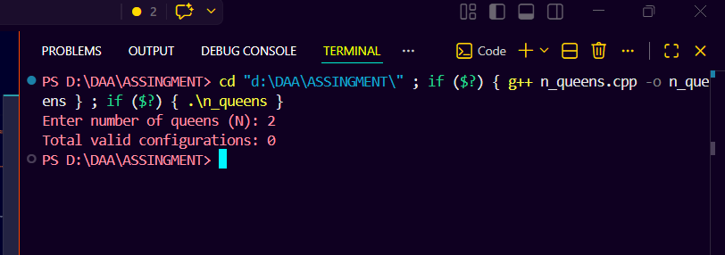
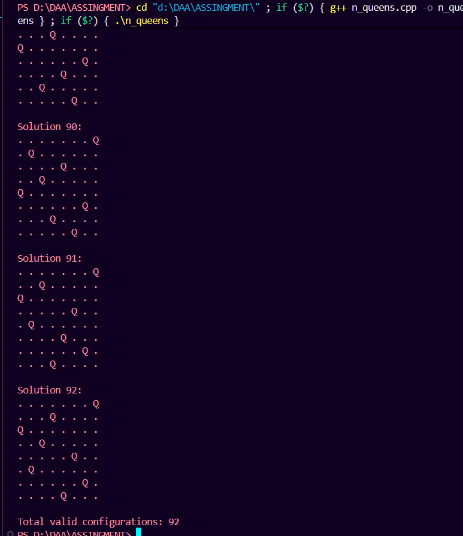
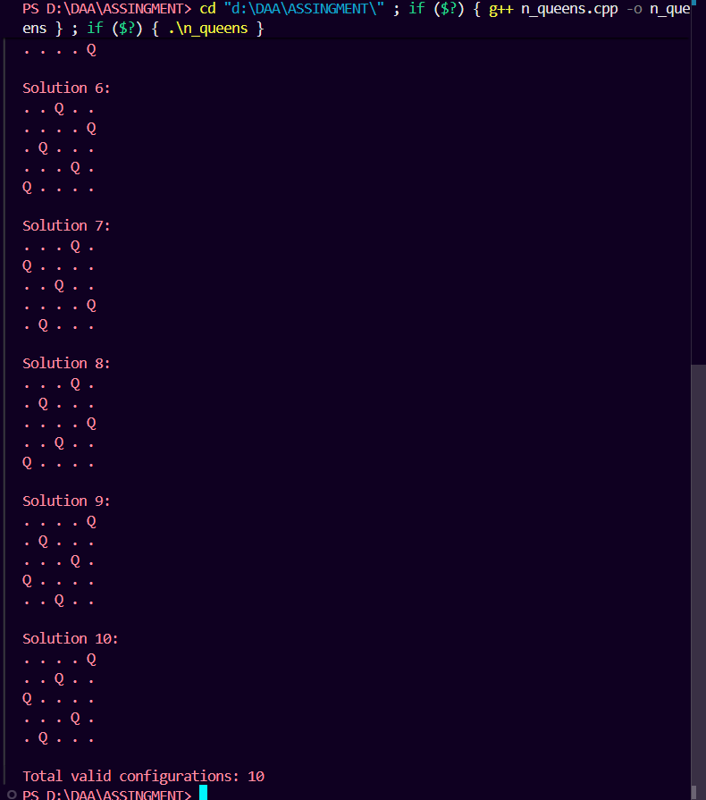
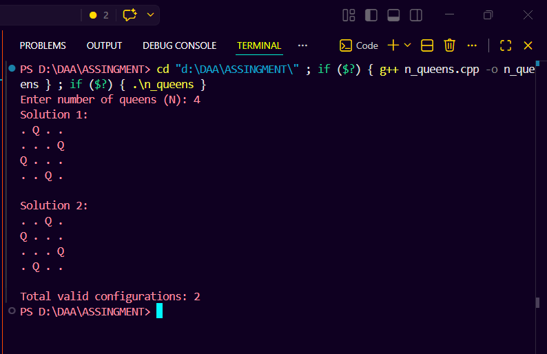

# N-Queens Problem

## Problem Statement

Place `N` queens on an `N x N` chessboard such that no two queens attack each other.

The program should:

- Print all possible solutions.
- Count the total number of valid configurations.
- Optimize checking using column and diagonal hashing.

## Approach

The solution uses backtracking. A queen is placed row by row. For every row, the program tries each column and checks whether the position is safe.

To make the safety check fast, three hash arrays are used:

- `colHash` checks whether a column is already occupied.
- `leftDiagHash` checks the left diagonal using `row + col`.
- `rightDiagHash` checks the right diagonal using `row - col + n - 1`.

The variable `q1` stores the column position of the queen for each row, and `q2` is used while trying possible columns.

## C++ Code

```cpp
#include <bits/stdc++.h>
using namespace std;

void printBoard(const vector<int> &q1, int n, int solutionNo) {
    cout << "Solution " << solutionNo << ":\n";

    for (int row = 0; row < n; row++) {
        for (int col = 0; col < n; col++) {
            if (q1[row] == col) {
                cout << "Q ";
            } else {
                cout << ". ";
            }
        }
        cout << '\n';
    }

    cout << '\n';
}

void solveQueens(int row, int n, vector<int> &q1, vector<int> &colHash,
                 vector<int> &leftDiagHash, vector<int> &rightDiagHash,
                 int &total) {
    if (row == n) {
        total++;
        printBoard(q1, n, total);
        return;
    }

    for (int q2 = 0; q2 < n; q2++) {
        int leftDiag = row + q2;
        int rightDiag = row - q2 + n - 1;

        if (colHash[q2] == 0 && leftDiagHash[leftDiag] == 0 &&
            rightDiagHash[rightDiag] == 0) {
            q1[row] = q2;
            colHash[q2] = 1;
            leftDiagHash[leftDiag] = 1;
            rightDiagHash[rightDiag] = 1;

            solveQueens(row + 1, n, q1, colHash, leftDiagHash, rightDiagHash,
                        total);

            q1[row] = -1;
            colHash[q2] = 0;
            leftDiagHash[leftDiag] = 0;
            rightDiagHash[rightDiag] = 0;
        }
    }
}

int main() {
    int n;

    cout << "Enter number of queens (N): ";
    cin >> n;

    if (n <= 0) {
        cout << "N should be greater than 0.\n";
        return 0;
    }

    vector<int> q1(n, -1);
    vector<int> colHash(n, 0);
    vector<int> leftDiagHash(2 * n - 1, 0);
    vector<int> rightDiagHash(2 * n - 1, 0);
    int total = 0;

    solveQueens(0, n, q1, colHash, leftDiagHash, rightDiagHash, total);

    cout << "Total valid configurations: " << total << '\n';

    return 0;
}
```

## How to Compile and Run

### Compile

```bash
g++ -std=c++17 n_queens.cpp -o n_queens
```

### Run

```bash
./n_queens
```

On Windows PowerShell:

```powershell
.\n_queens.exe
```

## Sample Input

```text
4
```

## Sample Output

```text
Enter number of queens (N): Solution 1:
. Q . .
. . . Q
Q . . .
. . Q .

Solution 2:
. . Q .
Q . . .
. . . Q
. Q . .

Total valid configurations: 2
```

## Output Screenshot

Paste your output image below this line:

<!-- Paste N-Queens output screenshot here -->
### output_1

### output_2

### output_3

### output_4

### output_5



## Complexity Analysis

### Time Complexity

```text
O(N!) + O(S * N^2)
```

Here, `N!` represents the backtracking search space, and `S * N^2` is the cost of printing all `S` valid board configurations.

Because column and diagonal hashing is used, each safety check takes `O(1)` time.

### Space Complexity

```text
O(N)
```

The program uses one array for queen positions, three hash arrays, and recursion stack space. All of these grow linearly with `N`.
