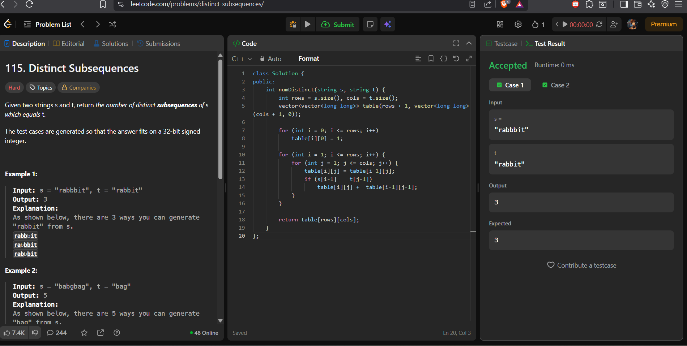
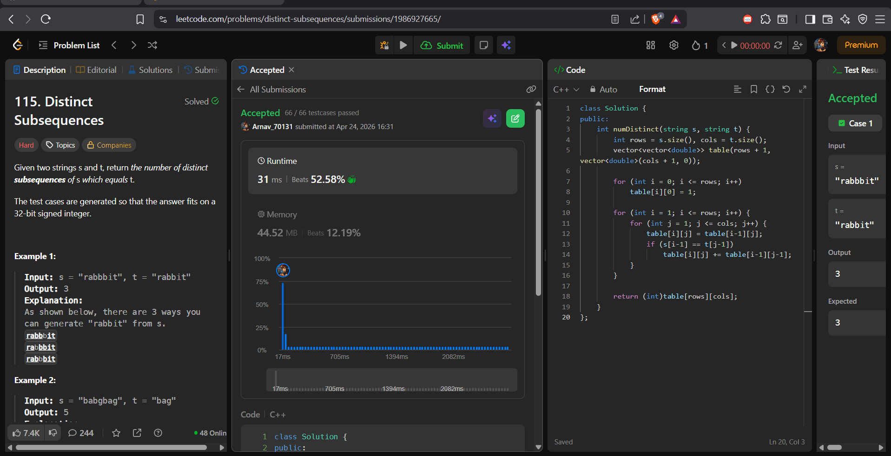

# Experiment 10: Distinct Subsequences'

## LEET CODE PROBLEM 115: Distinct Subsequences
### LINK: [https://leetcode.com/problems/distinct-subsequences/](https://leetcode.com/problems/distinct-subsequences/)


## Problem Statement:
    Given two strings s and t, return the number of distinct subsequences of s which equals t.
    A subsequence of a string is a new string generated from the original string by deleting some (or no) characters without changing the relative order of the remaining characters.
    Example 1:
    Input:
    s = "rabbbit"
    t = "rabbit"
    Output:
    3
    Explanation:
    There are 3 ways to delete one 'b' from "rabbbit" to form "rabbit".
    Example 2:
    Input:
    s = "babgbag"
    t = "bag"
    Output:
    5

## CODE
```cpp
#include <bits/stdc++.h>
using namespace std;
class Solution {
public:
    int numDistinct(string s, string t) {
        int rows = s.size(), cols = t.size();
        vector<vector<double>> table(rows + 1, vector<double>(cols + 1, 0));
        
        for (int i = 0; i <= rows; i++)
            table[i][0] = 1;
        
        for (int i = 1; i <= rows; i++) {
            for (int j = 1; j <= cols; j++) {
                table[i][j] = table[i-1][j];
                if (s[i-1] == t[j-1])
                    table[i][j] += table[i-1][j-1];
            }
        }
        
        return (int)table[rows][cols];
    }
};
``` 

## Algo
    1. Create a 2D table of size (rows+1) x (cols+1) initialized with 0.

    2. Fill the first column of the table with 1, as there is one way to form an empty subsequence from any string.

    3. Iterate through the table and fill it based on the following rules:
    - If the characters of s and t match, the value at table[i][j] is the sum of the value from the previous row (table[i-1][j]) and the value from the previous row and previous column (table[i-1][j-1]).
    - If the characters do not match, the value at table[i][j] is the same as the value from the previous row (table[i-1][j]).

1. Read strings s (length m) and t (length n).
2. Allocate (m+1) × (n+1) DP table, initialise to 0.
3. Set dp[i][0] = 1 for all i (base case).
4. Fill the table row by row (i = 1..m), column by column (j = 1..n)
   using the transition above.
5. Return dp[m][n].
    
## Time and space complexity


## Dry run


## Code Accepted screenshot

